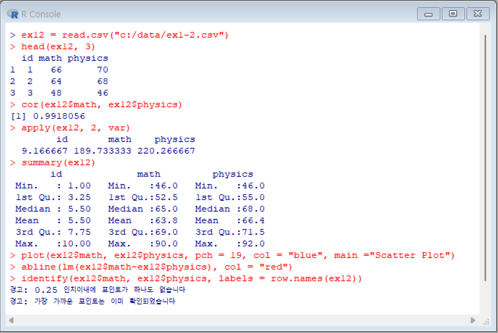
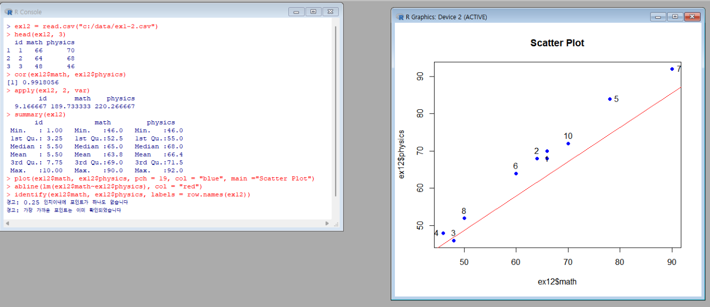
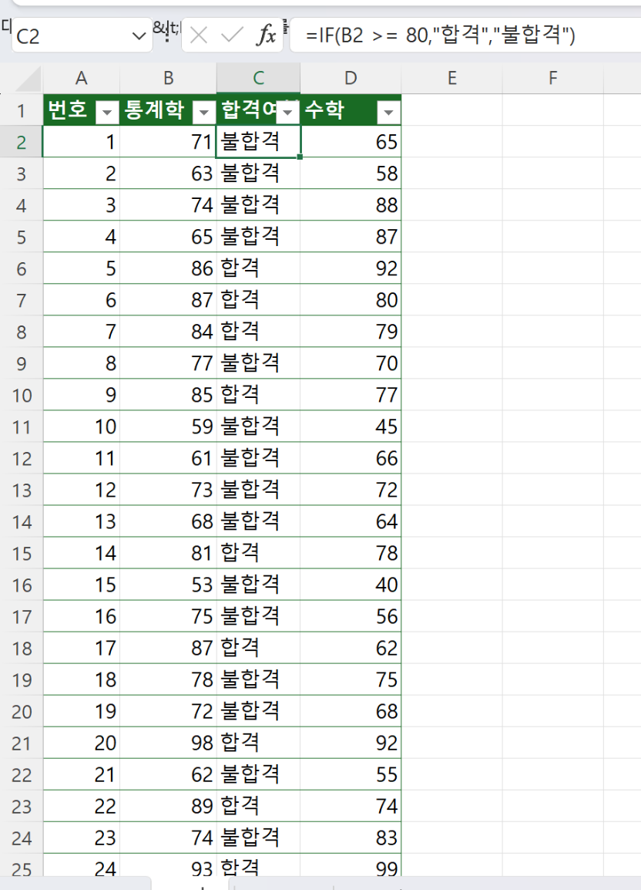
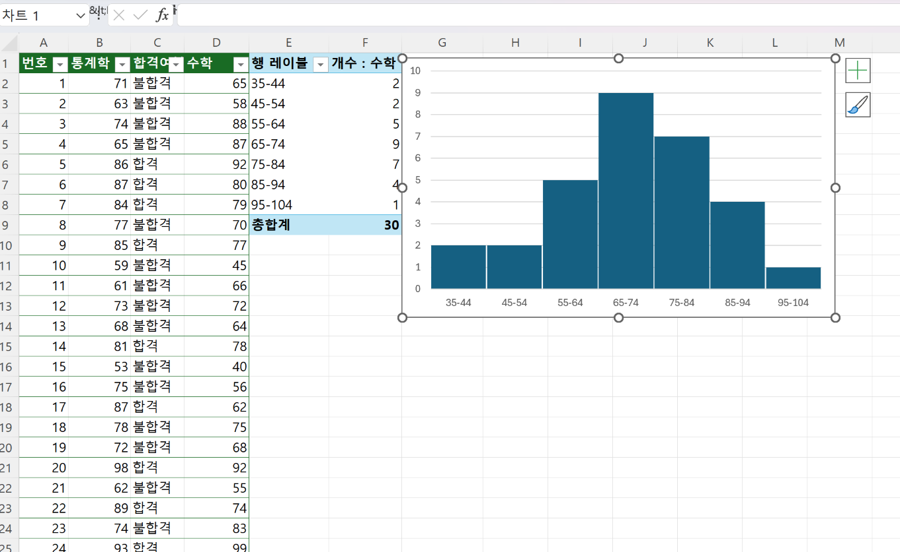

## 문제 1

ex1-2.csv 파일을 불러와서 상관계수, 분산, 다섯숫자요약을 구하고, 산점도 그래프를 완
성하시오.
단, 산점도 그래프에는 강의자료에서 사용하지 않은 pch, col, main 값을 반드시
적용하고 회귀라인을 나타내고 산점을 모두 식별하시오. (소스코드 및 작업결과 전체화면
캡처해서 첨부)

```
> ex12 = read.csv("c:/data/ex1-2.csv")
    # csv 파일을 ex12 객체에 저장

> head(ex12, 3)
  id math physics
1  1   66      70
2  2   64      68
3  3   48      46
    # ex12 파일에 3열까지 프린트(확인용)

> cor(ex12$math, ex12$physics)
[1] 0.9918056
    # ex12 객체의 math, physics 변수의 상관계수

> apply(ex12, 2, var)
        id       math    physics
  9.166667 189.733333 220.266667
    # ex12 데이터프레임의 각 열에 대해 분산을 계산
    # var: 적용할 함수, 분산을 계산하는 함수
    # 데이터가 평균으로부터 얼마나 퍼져있는지를 나타내는 통계량,
    표준편차와 관련있는 개념이며 표준편차는 분산의 제곱근으로,
    데이터가 평균 주변에 얼마나 퍼져있는지를 측정하는 통계량

> summary(ex12)
       id             math         physics
 Min.   : 1.00   Min.   :46.0   Min.   :46.0
 1st Qu.: 3.25   1st Qu.:52.5   1st Qu.:55.0
 Median : 5.50   Median :65.0   Median :68.0
 Mean   : 5.50   Mean   :63.8   Mean   :66.4
 3rd Qu.: 7.75   3rd Qu.:69.0   3rd Qu.:71.5
 Max.   :10.00   Max.   :90.0   Max.   :92.0
    # 평균,표준편차,중앙값,제1사분위수,제3사분위수,최솟값,최대값을 한번에 보여주는 명령어(다섯수치요약)

> plot(ex12$math, ex12$physics, pch = 19, col = "blue", main ="Scatter Plot")
    # 산점도 그래프 생성 ex12$math = x축 ex12$physics = y축,
    'pch=19'는 점의 모양 'col="blue"는 점의 색상 'main'은 그래프의 제목을 나타냄

> abline(lm(ex12$math~ex12$physics), col = "red")
    # 산점도 그래프에 선형 회귀선 추가 'col=red'는 회귀선의 색상

> identify(ex12$math, ex12$physics, labels = row.names(ex12))
    # 산점도 그래프 상의 데이터 포인트를 클릭하여 데이터를 식별하는 데 사용,
    각 데이터 포인트를 클릭하면 해당 데이터 포인트의 좌표와 행 이름이 표시
```




## 문제 2

엑셀을 이용하여 grade.txt 데이터에 대해서
(1) 통계학 성적이 80점 미만이면 불합격, 80점 이상이면 합격으로 처리하는 조건을 작성
하여 합격여부가 나오도록 출력하시오.
(조건이 작성된 해당 셀을 선택한 후 결과 전체화면 캡처해서 첨부)
(2) 수학 성적을 히스토그램(histogram) 그래프로 작성하시오. 막대(bar) 그래프이면 감점
(데이터 분석 도구의 대화상자 설정화면 및 실행결과 전체화면 캡처해서 첨부)

#### 우선 .txt 데이터를 가져오려면 다음과 같은 단계를 따라야한다.

1. 엑셀 상단 메뉴에서 "데이터(Data)" 탭을 클릭
2. "외부 데이터 가져오기(Get External Data)" 옵션을 선택
3. "텍스트(Text)" 를 선택하고 "다음(Next)" 를 클릭
4. 원하는 .txt 파일의 위치를 찾아 선택하고 열기를 클릭
5. 텍스트 마법사가 열리면 데이터 구분 기호를 선택(기본적으로 csv라면 ',' txt 라면 'tab'으로 구분)
6. 완료를 클릭하면 데이터를 가져옴

#### 합격 불합격 여부에 따라 조건식을 주고 싶다면

1. 통계학이 B 열에 있고 합격여부에 대한 셀이 C열에 존재한다고 가정
2. B열에는 각각의 통계학 점수가 존재
3. C열 2번째 부터 합불여부의 빈칸이 존재하기 때문에 해당 칸을 선택
4. 상단에 Fx 클릭
5. IF 함수를 검색한 후 확인
6. 여기서 logical_test 는 조건에 대한 내용인데 C의 2번째 행에 존재하는 바로 옆의 통계학 점수의 위치는 B의 2번째 행에 존재하기 때문에 B2 로 인식
7. B2 >= 80 / B2 가 80이상이라는 조건을 걸어줌
8. 아래로 value_if_true, value_if_false 가 존재하는데 이는 해당 조건이 참, 거짓일 경우의 적용할 value 를 뜻함
9. 원하는 조건대로 true에 "합격", false에 "불합격"을 입력 후 확인
10. 이렇게 되면 C2 행에만 불합격 표시가 되는데 해당 셀의 우측하단에 커서를 가져가보면 십자가 모양으로 채우기 핸들이나오는데 아래로 드래그 해주면 다른 행에도 해당 조건이 채워짐



#### 수학성적에 대한 히스토그램 만들기

- [참조](https://www.oppadu.com/shorts/%ec%97%91%ec%85%80-%ed%9e%88%ec%8a%a4%ed%86%a0%ea%b7%b8%eb%9e%a8-%eb%a7%8c%eb%93%a4%ea%b8%b0/)


